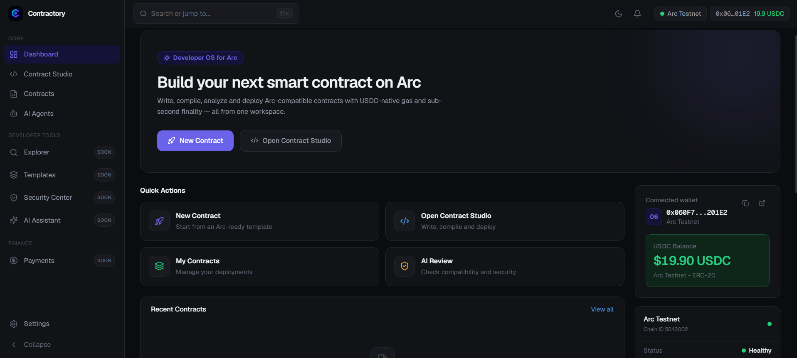
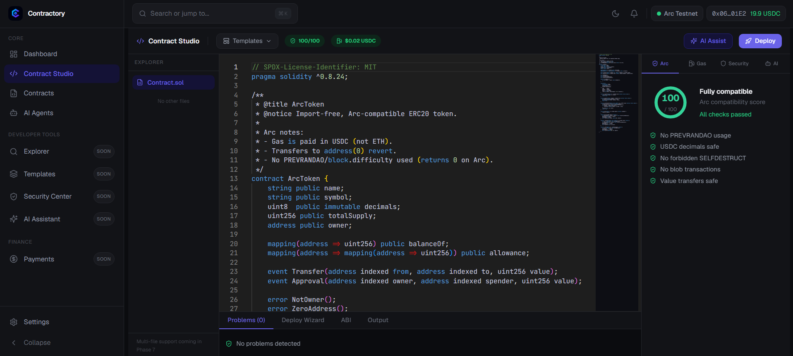
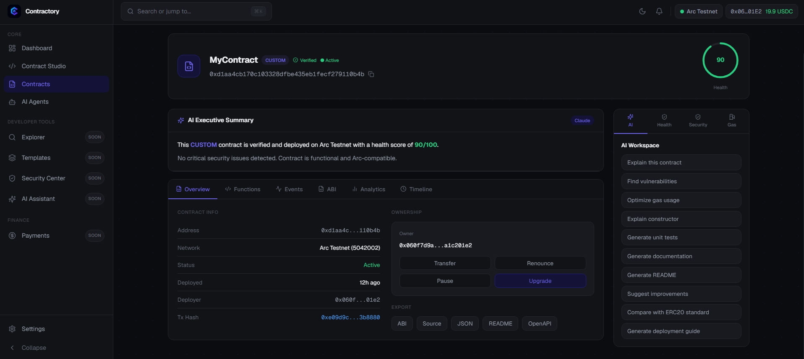

<div align="center">

# Contractory

**The open-source Developer OS for the Arc blockchain.**

Write, compile, analyze and deploy Arc-compatible smart contracts — with USDC-native gas and sub-second finality, all from one workspace.

[Live App](https://contractory.xyz) · [Report a bug](https://github.com/izmiradami/contractory/issues) · [Request a feature](https://github.com/izmiradami/contractory/issues)

</div>

---

## Overview

Contractory is a focused development environment for [Arc](https://www.circle.com/arc), Circle''s USDC-native EVM Layer 1. It takes a developer from an empty editor to a verified, on-chain contract without leaving the browser, and gives every deployment a clean control center for ongoing management.

The product is built around a single, polished developer journey:

**Connect Wallet → Open Contract Studio → Create ERC20 → Compile → Analyze → Deploy → Verify on ArcScan → Manage in the Contract Control Center.**

## Screenshots

### Dashboard


### Contract Studio


### Contract Control Center


## Features

- **Contract Studio** — A Monaco-based editor with import-free, Arc-compatible templates (ERC20, ERC721, ERC1155, ERC-8004, ERC-8183), real Solidity compilation, and an in-editor deploy wizard.
- **Arc Compatibility Analyzer** — Static checks for Arc-specific concerns (USDC-native gas, no PREVRANDAO, no forbidden SELFDESTRUCT, safe value transfers) with a 0–100 compatibility score.
- **Security & Gas panels** — Vulnerability scanning and USDC gas estimation before you deploy.
- **One-click deploy & verify** — Deploy to Arc Testnet and verify source on ArcScan, paying gas in USDC.
- **Contract Control Center** — Per-contract overview, ABI, functions, events, and an AI-assisted executive summary, backed by real on-chain and stored data.
- **Wallet & auth** — Wallet connection via RainbowKit/wagmi with Sign-In With Ethereum (SIWE).

## Tech Stack

- **Framework:** Next.js 15 (App Router), React 19, TypeScript
- **Styling:** Tailwind CSS
- **Wallet:** wagmi + RainbowKit, viem, SIWE
- **Editor:** Monaco
- **Persistence:** Supabase
- **Chain:** Arc Testnet (Chain ID `5042002`, USDC-native gas)

## Getting Started

### Prerequisites

- Node.js 18.18 or later
- An Arc Testnet wallet (e.g. Rabby or MetaMask) with test USDC for gas

### Installation

```bash
# Clone the repository
git clone https://github.com/izmiradami/contractory.git
cd contractory

# Install dependencies
npm install

# Set up environment variables (see below)
cp .env.example .env.local

# Run the development server
npm run dev
```

Open [http://localhost:3000](http://localhost:3000) in your browser.

### Environment Variables

Create a `.env.local` file in the project root:

```bash
NEXT_PUBLIC_SUPABASE_URL=your-supabase-url
NEXT_PUBLIC_SUPABASE_ANON_KEY=your-supabase-anon-key
NEXT_PUBLIC_WALLETCONNECT_PROJECT_ID=your-walletconnect-project-id
NEXT_PUBLIC_ARC_RPC_URL=https://rpc.testnet.arc.network
NEXT_PUBLIC_APP_URL=http://localhost:3000
```

All variables are public client-side values. Never commit private keys or secrets to the repository.

## Deployment

Contractory deploys cleanly to [Vercel](https://vercel.com):

1. Import the repository into Vercel.
2. Add the environment variables above in the project settings.
3. Deploy. Vercel builds with `npm run build` automatically.

## Roadmap

Contractory v1.0 is focused on the core contract-development journey. Planned for **v1.1** and beyond:

- **Explorer** — A native Arc block, transaction and contract browser.
- **Templates** — A searchable gallery of Arc-ready contract templates.
- **Security Center** — Portfolio-wide static analysis and audit history.
- **AI Assistant** — A conversational pair-programmer for Arc Solidity.
- **Payments Hub** — USDC send, bridge, swap and automations.
- **AI Agents** — On-chain agent identity and reputation (ERC-8004 / ERC-8183).

These appear in the app today as premium "Coming Soon" previews — no mock data, no fake interactions.

## Contributing

Contributions are welcome. Please see [CONTRIBUTING.md](CONTRIBUTING.md) for guidelines.

## Security

Please review [SECURITY.md](SECURITY.md) for how to report vulnerabilities. **Never** commit private keys, seed phrases, or secrets — all credentials belong in environment variables only.

## License

Released under the [MIT License](LICENSE).

---

<div align="center">

Built by **Woodstone Studio**

</div>